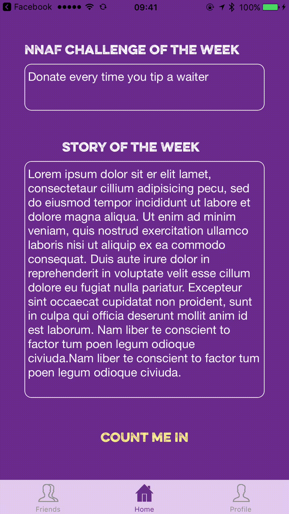

## Abortion Access Hackathon 2017
### Team Dinosaur

* Myra Lukens - Developer
* Gloria Liu - Developer
* Sonja Johnson-Yu - Entrepreneur

### Demo
contribu is an iOS app that gamifies donating to abortion funds.

On their first login, the user sees information about why donating to abortion is important

On the homepage, the user sees a weekly challenge posted by NNAF
The user can choose to participate in this challenge by tapping "Count Me In"
At this point, the user will choose how much to pledge. Every time they do what the challenge is, they donate this amount of money to NNAF.

The user can donate, and the app will display the total amount they have donated for this challenge

The user can also view their profile and previous challenges they have created and the amount donated

Using Facebook authentication, the user can compete with their friends that are active on the app

contribu incentivizes small, frequent donations to abortion funds, and entices users with the gamification
